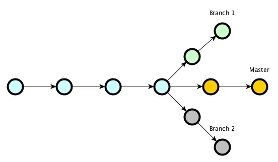

## *Основы*   
**Git** — это набор консольных утилит, которые отслеживают и фиксируют изменения в файлах (чаще всего речь идет об исходном коде программ, но вы можете использовать его для любых файлов на ваш вкус). Изначально Git был создан Линусом Торвальдсом при разработке ядра Linux. Однако инструмент так понравился разработчикам, что в последствии, он получил широкое распространение и его стали использовать в других проектах. С его помощью вы можете сравнивать, анализировать, редактировать, сливать изменения и возвращаться назад к последнему сохранению. Этот процесс называется контролем версий.

**Для чего он нужен?** 

 Ну во-первых, чтобы отследить изменения, произошедшие с проектом, со временем. Проще говоря, мы можем посмотреть как менялись файлы программы, на всех этапах разработки и при необходимости вернуться назад и что-то отредактировать. Часто бывают ситуации, когда, во вполне себе работающий код, вам нужно внести определенные правки или улучшить какой-то функционал, по желанию заказчика. Однако после внедрения нововведений, вы с ужасом понимаете, что все сломалось. У вас начинается судорожно дергаться глаз, а в воздухе повисает немой вопрос: “Что делать?” Без системы контроля версий, вам надо было бы долго напряженно просматривать код, чтобы понять как было до того, как все перестало работать. С Гитом же, все что нужно сделать - это откатиться на коммит назад.

Во-вторых он чрезвычайно полезен при одновременной работе нескольких специалистов, над одним проектом. Без Гита случится коллапс, когда разработчики, скопировав весь код из главной папки и сделав с ним задуманное, попытаются одновременно вернуть весь код обратно.
Git является распределенным, то есть не зависит от одного центрального сервера, на котором хранятся файлы. Вместо этого он работает полностью локально, сохраняя данные в директориях на жестком диске, которые называются репозиторием. Тем не менее, вы можете хранить копию репозитория онлайн, это сильно облегчает работу над одним проектом для нескольких людей. Для этого используются сайты вроде github и bitbucket.


# *Инструкция по настройке  Git!!!*

## 1. Проверка наличия установленного Git.
В терминале выполнить команду 
``` 
git version 

```

Если Git установлен и настроен правильно, появится сообщение с версией программы.
Иначе будет сообщение об ошибке.

## 2. Установка Git.
Загружаем последнюю версию Git с сайта: https://git-scm.com/downloads и устанавливаем с настройками по умолчанию.

## 3. Настройка Git.
При первом использовании Git необходимо представиться.
Для этого нужно ввести в терминале 2 команды:
```
git config --global user.name «Ваше имя английскими буквами»

git config --global user.email ваша почта@example.com
```
Теперь каждое наше действие будет отмечено именем и почтой. Таким образом, пользователи всегда будут в курсе, кто отвечает за какие изменения — это вносит порядок.


# *По выполнению всех условий можем приступать к работе с Git! :)*

Git хранит весь пакет конфигураций в файле .gitconfig, находящемся в вашем локальном каталоге. Чтобы сделать эти настройки глобальными, то есть применимыми ко всем проектам, необходимо добавить флаг –global. Если вы этого не сделаете, они будут распространяться только на текущий репозиторий.
Для того, чтобы посмотреть все настройки системы, используйте команду:
```
git config --list
```
*Если вы не до конца настроили систему для работы, в начале своего пути - не беда. Git всегда подскажет разработчику, если тот запутался, например:*

-  Команда **git --help** - выводит общую документацию по git

-  Если введем **git log --help** - он предоставит нам документацию по какой-то определенной команде (в данном случае это - log)

-  Если вы вдруг сделали опечатку - система подскажет вам нужную команду

- После выполнения любой команды - отчитается о том, что вы натворили

- Также Git прогнозирует дальнейшие варианты развития событий и всегда направит разработчика, не знающего, куда двигаться дальше

*Тут стоит отметить, что подсказывать система будет на английском, но не волнуйтесь, со временем вы изучите несложный алгоритм ее работы и будете разговаривать с ней на одном языке.*


# *Создание нового репозитория*
Как мы отметили ранее, git хранит свои файлы и историю прямо в папке проекта. Чтобы создать новый репозиторий, нам нужно:
1. Создайте на рабочем столе папку под названием Git
2. В приложение создаем фаил с разрешением **.md**
3. Включаем автосахронение (Файл -> Автосахронение)
4. Открываем терминал. Выбираем терминал (Git Bash)
5. Выполняем команду **git init**

Это включит приложение в этой конкретной папке и создаст скрытую директорию .git, где будет храниться история репозитория и настройки.

# Определение состояния
 **git status** — это одна из важнейших команд, которая показывает информацию о текущем состоянии репозитория: актуальна ли информация на нём, нет ли чего-то нового, что поменялось, и так далее. 

 # Подготовка файлов
В Git есть концепция области подготовленных файлов. Можно представить ее как холст, на который наносят изменения, которые нужны в коммите. Сперва он пустой, но затем мы добавляем на него файлы (или части файлов, или даже одиночные строчки) командой
```
git add (имя файла)
```

# Фиксация изменений и создание коммита
 Для сохранения изменений, их необходимо закоммитить. Для этого необходимао ввести команду **git commit -m 'Комментарий'**. Но сначала, мы должны обозначить эти файлы для Git, при помощи команды **git add (имя файла)**, добавляющей (или подготавливающей) их к коммиту. 
 ```
 1. git add (имя файла)

 2. git commit -m 'Комментарий'
 ```
 Флажок **-m** задаст *commit message* - комментарий разработчика. Он необходим для описания закоммиченных изменений. И здесь работает золотое правило всех комментариев в коде: «Максимально ясно, просто и содержательно обозначь написанное!»

# Просмотр коммитов
Для просмотра все выполненных фиксаций можно воспользоваться историей коммитов. Она содержит сведения о каждом проведенном коммите проекта. Запросить ее можно при помощи команды:
```
git log
```
В ней содержиться вся информация о каждом отдельном коммите, с указанием его хэша, автора, списка изменений и даты, когда они были сделаны. Отследить интересующие вас операции в списке изменений, можно по хэшу коммита, при помощи команды *git show* :
```
git show hash_commit
```
Ну а если вдруг нам нужно переделать commit message и внести туда новый комментарий, можно написать следующую конструкцию:
```
git commit --amend -m 'Новый комментарий'
```
В данном случае сообщение последнего коммита перезапишется. **Но злоупотреблять этим не стоит, поскольку эта операция опасная и лучше ее делать до отправки коммита на сервер.**

# Синтаксис языка Markdown
```
- Заголовок – выделение заголовков. Количество символов “#” задаёт уровень заголовка
(поддерживается 6 уровней).
-  = или - – подчёркиванием этими символами (не менее 3 подряд) выделяют заголовки
первого (“=”) и второго (“-”) уровней.
-  ** Полужирное начертание** или __ Полужирное начертание__
-  *Курсивное начертание* или _Курсивное начертание_
-  ***Полужирное курсивное начертание***
-  ~~Зачёркнутый текст~~
-  * Строка – ненумерованные списки, символ “*” в начале строки
-  1, 2, 3 … – нумерованные списки
```


## Ветки в Git и как они работают:

Ветка Git это простой перемещаемый указатель на один из коммитов, обычно последний в цепочке коммитов. По умолчанию имя основной ветки в Git -``` *master*.```

## Создание веток в Git.
Создать ветку можно командой:  
``` 
git branch (имя ветки)
``` 

Так же для создание новой ветки и автоматического перехода в нее, используется команда:
```
git switch -c (имя ветки)
```
В результате создается новый указатель на текущий момент.

Спиоск веток можно посмотреть командой :
```
git branch
```
Текущая ветка отображается звездочкой ```( *master )```


# Повторение изученного и команды которые необходимо знать :)
 1. ``` dit init - создает новый репозиторий Git. С ее помощью можно преобразовать существующий файл без управления версиями в репозиторий Git или инициализировать новый пустой репозиторий.         Большинство остальных команд Git невозможно использовать без инициализации репозитория, поэтому данная команда обычно выполняется первой в рамках нового файла. ```
 2. ``` dit status - отображает состояние рабочего каталога и раздела проиндексированных файлов. С ее помощью можно проверить индексацию изменений и увидеть файлы, которые не отслеживаются Git. Информация об истории коммитов файла не отображается при выводе данных о состоянии.```
 3. ``` git add - это первая команда в цепочке операций, предписывающей Git «сохранить» снимок текущего состояния файла в истории коммитов. Когда git add используется как отдельная команда, она переносит ожидающие изменения из рабочего каталога в раздел проиндексированных файлов.```
 4. ``` git commit -m - команда для записи индексированных изменений в репозиторий Git. Флаг -m прописывает комментарий к файлу на данный момент.```
 5. ``` git log - показывает всю историю коммитов и позволяет быстро просмотреть все изменения, сделанные с файлом. ```
 6. ```git diff - это функция cравнения, анализирующая два входных набора данных и отображающая различия между ними.```
 7. ``` git checkout -  подразумевают переключение между различными версиями целевого объекта. Команда git checkout работает с тремя различными объектами: файлами, коммитами и ветками. ```
 8. ``` git checkout master - возвращает к актуальной версии файла и продолжает работу в ней.```